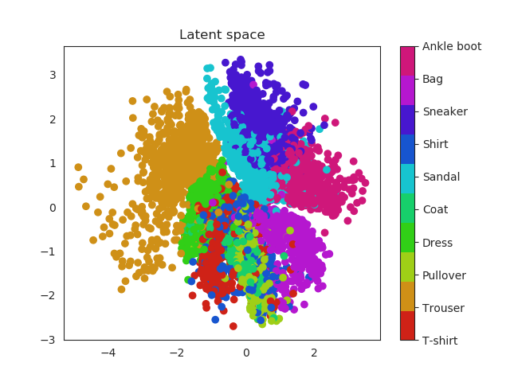
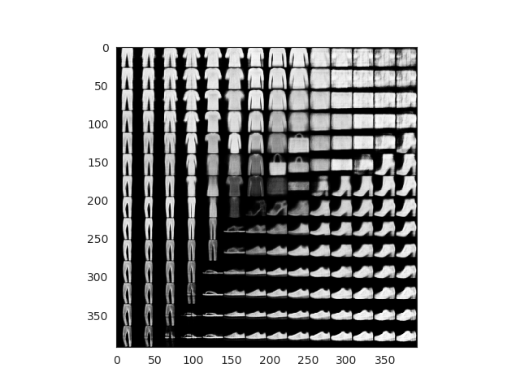

# Tensorflow VAE 

This repository contains an implementation of a Variational Autoencoder. See in depth tutorial on Medium post titled [VAEs I ! Generating images with Tensorflow
](https://medium.com/@miguelmndez_30551/vaes-i-generating-images-with-tensorflow-f81b2f1c63b0).


### Parameters

```
-- learning_rate      Initial learning rate
--epochs              Number of training epochs 
--batch_size          Minibatch training size
--latent_dim          Number of latent space dimensions
--test_image_number   Number of test images to recover during training
--inputs_decoder      Size of decoder input layer
--dataset             Dataset name [mnist, fashion-mnist]
--logdir              Log folder
--plot_latent         Plot latent space distribution [True, False]
```

### Run 

```bash
$ python autoencoder.py  --latent_dim=2 --dataset=mnist --epochs=50
```

### Example





